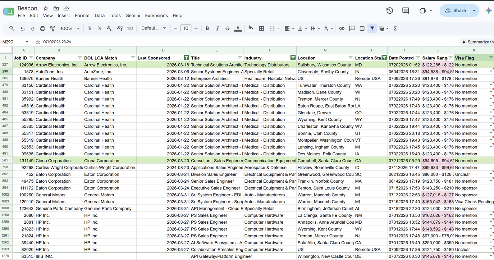
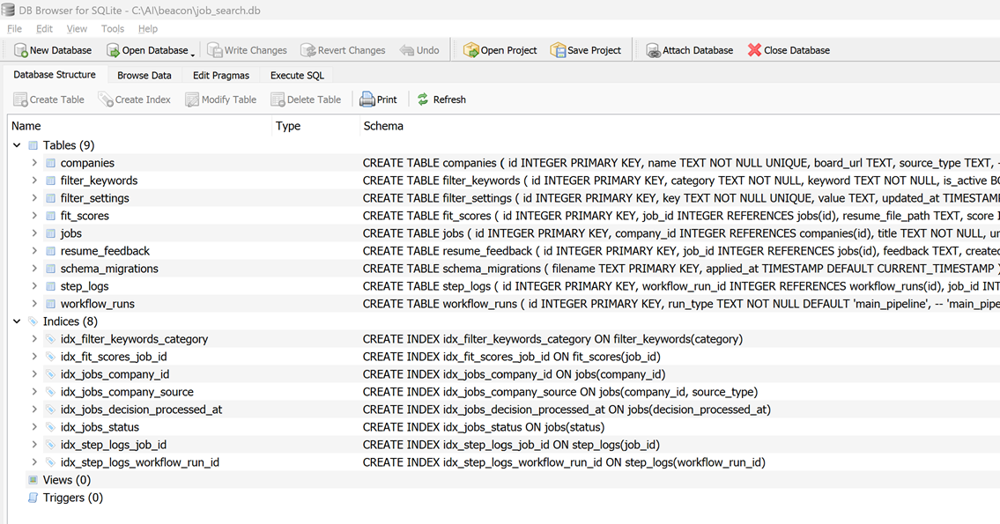
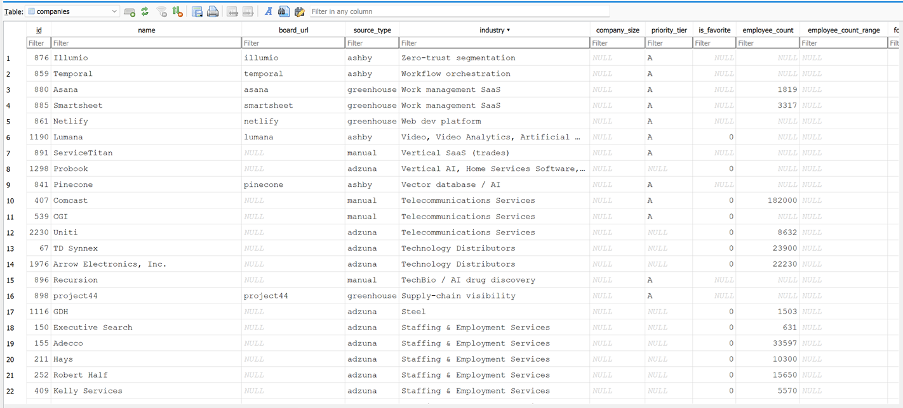
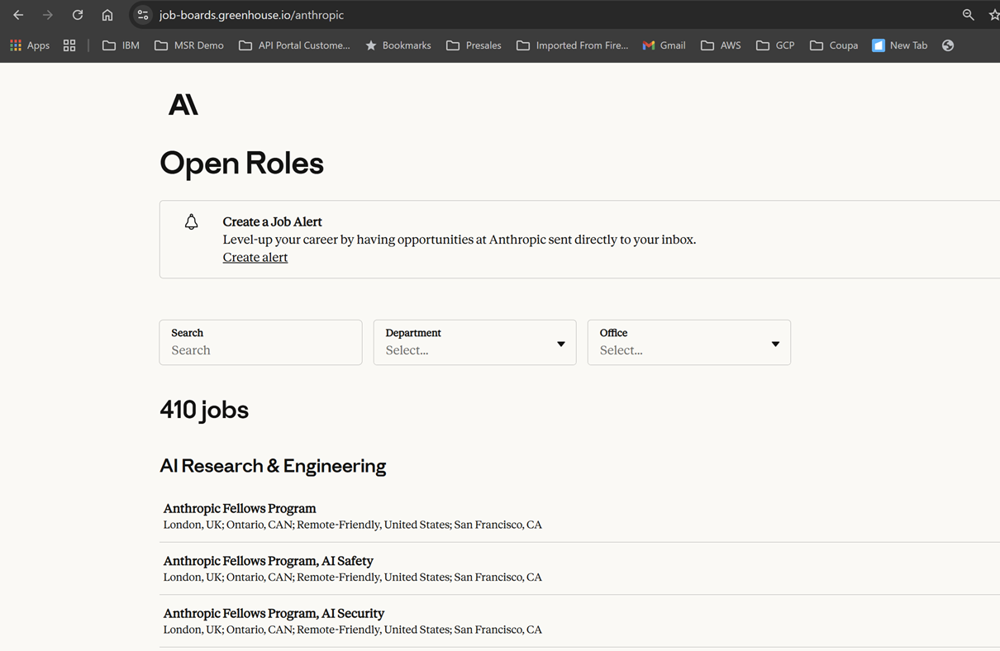
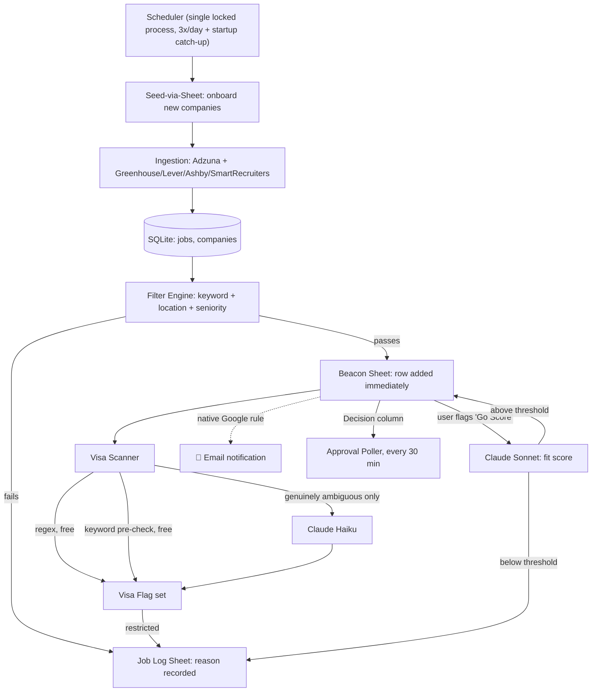

# 🔭 Beacon — Job Search Automation for Work Visa Holders

**In plain words:**
- Beacon finds job postings for you, automatically, based on your own keywords.
- It checks each one and flags whether that company will actually sponsor a work visa (H-1B).
- Everything shows up in a Google Sheet — practical, right on your phone, no new app to learn.
- It runs entirely on your own computer. Private by design — nobody else ever sees your search.

## 📸 See it in action

| Beacon Tracking Sheet | SQLite Schema |
|---|---|
|  |  |

| Sample Company Data | Source: a real public Greenhouse job board |
|---|---|
|  |  |

*(Company/job data above is from a live personal account — the Decision/My Decision columns shown are unset defaults, not personal choices. See `docs/screenshots/README.md` for the full redaction notes.)*

> **The longer version:** This is not a job site, a hosted service, or an app you sign up for. It's a free, open-source Python program you install and run yourself, entirely on your own computer. It discovers postings across the web, automatically screens out visa-sponsorship dead ends, scores fit against your resume, and surfaces everything in a Google Sheet you already know how to use — for pennies, because AI is only called when it's actually needed. Since it only ever runs on your own machine, nothing about your job search is ever captured, stored, or seen by anyone but you.


**Tags**: `h1b` `visa-sponsorship` `job-search` `international-students` `opt` `stem-opt` `immigration` `career-tools` `claude-ai` `automation`

**If this saves you time, a ⭐ helps other visa holders find it too.**

### Who this is for

- H-1B holders, F-1 OPT/STEM-OPT students, and anyone else whose job search has to filter for visa sponsorship
- Anyone tired of discovering a sponsorship dead-end three paragraphs into a job description, after already spending time on it
- Job seekers in any keyword-matchable field, not just tech — the role/tech keyword lists are fully yours to redefine
- Anyone who doesn't want to spend money on AI unnecessarily
- Anyone who'd rather track their job search in their own private Google Sheet than log into yet another dashboard
- Builders curious what a real, production Claude Code build looks like end-to-end, bugs and all (see [`RUNBOOK.md`](./RUNBOOK.md))

---

## 🎯 The Goal

**Every work visa holder should be able to find jobs suitable for them, and apply to companies that actually sponsor work visas, with real information about who has sponsored before.** That's the point: less headache, less wasted time, more of your search actually going toward employers who'll consider you.

And this has to stay free for anyone to adopt without a second thought. It's already low cost today, under $1/month for typical personal use (see [Cost Model](#-cost-model--ai-only-when-its-actually-needed) for the real numbers) — but "low cost" still means worrying about a bill. The real goal, not built yet, is running visa and job-fit classification on open-weight models on your own laptop instead of a paid API at all: **$0**, permanently, so nobody has to think about AI spend to run their own job search.

---

## Why this exists

If you're job-hunting on a visa (H-1B, OPT/STEM-OPT, or otherwise), you already know the real cost isn't finding job postings — it's the hours lost reading through postings that were never going to sponsor you in the first place, often three paragraphs deep in EEO boilerplate that never even mentions "visa" until the very last sentence.

Beacon was built to remove that specific waste, for close to $0:

- **Never manually re-check "do they sponsor?" again.** Every posting's own text is automatically screened for sponsorship language and labeled `Sponsored` / `No sponsor` / `No mention` / `Unclear` before you ever open it.
- **You define what "relevant" means, not a hardcoded list.** The role/tech keyword lists that decide what gets surfaced at all are stored in a database table, not buried in code — retarget it for your own field in the Sheet or the DB, no redeploy needed.
- **AI is the last resort, not the first.** See [Cost Model](#-cost-model--ai-only-when-its-actually-needed) below — the real numbers, not a guess.
- **Runs unattended, three times a day**, and lands everything in a Google Sheet — no new app to learn, no dashboard to check obsessively.

## 💸 Why not just pay for LinkedIn Premium?

Fair question. LinkedIn Premium doesn't solve the one thing that costs visa holders the most time:

| | **LinkedIn Premium** | **Beacon** |
|---|---|---|
| Detects visa sponsorship | ❌ Not a feature — you read every posting yourself | ✅ Auto-classified, restrictions caught automatically |
| Cost | ~$30–$40/month, forever | Free software — real lifetime AI cost so far: **$8.88** across 137,000+ postings |
| Filter logic | Black-box "match" score | Every rule lives in a table you can read and edit |
| Privacy & tracking | Public "Open to Work" status; only sees LinkedIn's own Apply flow | Fully private, your own Sheet — tracks any job however you actually applied |

**The short version**: it replaces the one feature visa holders need most — "will this company even consider me" — at a fraction of a month's subscription.

### AI touches exactly two decisions in this entire pipeline

1. **Visa fit** — does *this posting's own text* rule out sponsorship? Only asked when free keyword/regex checks can't tell. (Posting text only, not company history — see the next section for that.)
2. **Job fit** — does this posting match your resume? Only asked when you type `Go Score` into that row's **My Decision** cell.

### Real historical sponsorship data (DOL LCA), separate from posting-text classification

This is a second, distinct signal, and it's real government data, not another guess from posting text. The Department of Labor's Office of Foreign Labor Certification (OFLC) publishes quarterly LCA (H-1B, H-1B1, E-3) disclosure data — every employer that filed, and when. Matched against your own tracked companies, it answers "has this company actually sponsored before, and when," which no posting's own text can tell you.

A match means **"Likely work visa sponsor"** — a positive historical signal, not a guarantee. A company that filed an LCA before has, at minimum, gone through the process once; it says nothing about whether *this specific posting* will sponsor. A company can have a strong filing history and still post a req that explicitly says no sponsorship (different team, changed policy, one recruiter's mistake) — read the individual posting's own Visa Flag too, don't rely on a company-level match alone. And the absence of a match doesn't mean a company won't sponsor — it may simply have never needed to yet, or its filings may be under a different legal entity name.

**This isn't automated** — DOL's site blocks unattended downloads (confirmed live: this project's own automated browser tool and a plain HTTP request were both blocked), so it's a manual, one-time-per-quarter step:

1. Go to the [OFLC Performance Data page](https://www.dol.gov/agencies/eta/foreign-labor/performance), expand "Disclosure Data," and download the current quarter's LCA `.xlsx` file (it's real, ~137MB, ~1M rows). Each file is cumulative *within its own federal fiscal year* (Oct 1 – Sep 30), so downloading more than one quarter of the same fiscal year adds nothing — for real multi-year history, download one file per fiscal year you want covered (typically that year's last/Q4 release)
2. Run `python -m app.cli lca-enrich <path-to-file> [<path-to-another-file> ...]` — pass as many files as you downloaded in one call; it merges them, keeping the most recent filing date per employer across all of them
3. It matches every tracked company by name and updates two new Sheet columns, `DOL LCA Match` and `Last Sponsored`, plus the underlying `companies.dol_lca_employer_name`/`last_lca_certified_date` columns

Same name-matching risk as everywhere else in this pipeline (see the LinkedIn Premium comparison and Cost Model above) — real-world validation against this project's own 2,682-company table found 223 matches from a single quarter with zero false positives spotted, including in the highest-collision-risk short-name group, but this isn't a guarantee for every name.

**This signal is entirely separate from the Visa Flag/Haiku classification above, and doesn't reduce its AI usage** — a company-level LCA match isn't currently used to skip or shortcut the per-posting Haiku check, since a historical filing says nothing about what *this specific posting's own text* says. The two run side by side, not one instead of the other.

Everything else, discovery, deduplication, keyword matching, location resolution, salary extraction, company enrichment, is plain code with zero AI involved.

> **One word, "Go Score", is the only thing in this entire pipeline that ever spends an AI token on your behalf. Everything else, including visa screening, either runs on free pattern matching or doesn't run at all until you ask.**

Here's exactly how each of those two decisions gets made:

### How the keyword + AI pipeline actually works

```
Every posting →  keyword match (role/tech titles)  →  does it even mention "visa"/"sponsor"/"h1b"/etc?
                          │                                          │
                    no match → discarded,                    no  → "No mention", $0, done
                    zero cost, zero AI                         │
                                                                yes → regex-confident phrase?
                                                                          │            │
                                                                    yes, $0      no → Haiku classifies
                                                                    done         (only the genuinely
                                                                                  ambiguous remainder)
```

Three tiers, cheapest first — a real posting only ever reaches an LLM if a human would also have to actually read the sentence carefully to decide. Everything upstream of that (does this even look like a role I want, does it even mention sponsorship at all) is free, deterministic Python.

**What Haiku actually sees and returns, for that last genuinely ambiguous tier:**
- **Input**: the job's title, its location, and up to 12,000 characters of the description (not just a short prefix — sponsorship language is legal/EEO boilerplate that's frequently near the *end* of a posting, and an earlier, shorter truncation really did cut off the deciding sentence in testing)
- **Task**: classify sponsorship specifically for *this posting's own location*, not sponsorship in general. A posting that says "we can sponsor visas to Germany" on a US-based role gets classified `restricted` for the US, not `sponsors`, even though the word "sponsor" appears in a positive sentence right there in the text
- **Output**: a forced-structure JSON response, exactly `{"visa_flag": "restricted" | "sponsors" | "unclear", "snippet": "..."}` — never free-form text, and the snippet is a direct quote from the actual posting, not a paraphrase, so you can always see exactly which sentence drove the call
- That result gets written straight to the job's row and, if it comes back `restricted`, the posting is automatically evicted from your Sheet before you ever see it as a live match

### You put AI on command, one job at a time

The resume-fit scoring step (Claude Sonnet) never runs on its own. It's controlled entirely by a single Sheet column, **My Decision**, which is just a dropdown on each row. `Go Score` here means specifically "go score *job fit*" against your resume — it has nothing to do with visa fit, which is checked automatically and never needs a manual trigger:

| Value | Who sets it | What happens |
|---|---|---|
| `New` | App, by default | Nothing. This is every job's starting state — no AI has looked at it |
| `Go Score` (i.e. "go score job fit") | **You** | You're telling the pipeline "spend an AI call scoring this one against my resume." This is the only manual AI trigger anywhere in the pipeline — nothing happens to any other row |
| `AI Score Pending` | App | Claimed right before the Sonnet call, so a failure retries automatically instead of getting stuck or silently skipped |
| `AI Scored` | App | Done — the score is now on the row |
| `Manual Scored` | You | Your own judgment call, no AI involved at all |
| `Reject` | You | Removes the row, no AI involved |

There's no "score everything" button, and no background job silently scoring your whole backlog. Every single Sonnet call in this pipeline exists because you typed `Go Score` into one specific cell. That's what "AI where it matters, automation everywhere else" actually looks like in practice, not just as a slogan.

---

## ✨ Key Features

- **Five job sources**: broad keyword discovery via Adzuna, plus direct polling of Greenhouse, Lever, Ashby, and SmartRecruiters for companies you specifically track — no query-time filtering needed on the targeted side, every posting is pulled and filtered locally
- **Self-onboarding companies**: type a company name into a `SEED` row on the Sheet and the pipeline guesses and verifies a real job-board slug across all four ATS platforms automatically — no manual API digging
- **Three-tier visa classification**: regex → free keyword pre-check → Haiku, cheapest first (see Cost Model)
- **Live-editable filter criteria**: role/tech keyword include-lists, title excludes, seniority, location, posted-date window, company priority tier — all in a SQLite table, editable without touching code
- **Fit scoring on demand, not by default**: Claude scores a job against your resume only when *you* flag it `Go Score` on the Sheet — never runs against the whole backlog automatically
- **Free company enrichment**: employee count, funding stage, HQ, revenue — from two free-tier APIs only, with zero LLM fallback (a field just stays blank rather than ever costing money to fill in)
- **US location resolution** from messy free-text (`"US-CA-Menlo Park"`, bare city names, county-only strings) against public Census reference data — no geocoding API
- **AWS/GCP/Azure detection** from posting text, with a refresh pass for postings whose source truncates the description
- **Dead-link detection**: postings that get pulled after you've already seen them get automatically evicted from the Sheet, not left as a broken link
- **Google Sheets as the entire UI**: notification, approval, and status tracking are all native Sheets features — no dashboard, no login, no separate app to check
- **Runs unattended** via a single locked, crash-recovering scheduler process — main pipeline 3x/day, fit-scoring and company enrichment on their own offset schedules, an approval poller every 30 minutes

---

## 🏗️ Architecture



Full diagram with every field/table: [`docs/ARCHITECTURE.md`](./docs/ARCHITECTURE.md)

---

## 🛠️ Tech Stack

| Layer | Technology |
|---|---|
| **Language** | Python 3.14 |
| **Scheduling** | APScheduler (`BlockingScheduler`, single-instance file lock) |
| **Database** | SQLite, WAL mode |
| **Tracking / UI / Notification** | Google Sheets via `gspread` (service account auth) |
| **LLM** | Anthropic Claude — Haiku 4.5 (visa classification), Sonnet 5 (fit scoring) |
| **Job sources** | Adzuna API, Greenhouse, Lever, Ashby, SmartRecruiters (all public/free) |
| **Company data** | Financial Modeling Prep + StartupHub.ai (both free tier) |
| **Location resolution** | US Census county/place reference data (bundled, public domain) |
| **HTTP** | `requests`, with retry/backoff on rate limits and transient errors |

---

## ⏱️ Time Saved — The Jobs You Never Had to Read

Real funnel numbers from this project's own history, out of every posting it has ever seen:

| Stage | Jobs |
|---|---|
| Total postings ingested | **137,318** |
| Automatically deduplicated (same posting seen across multiple sources) | 110,851 |
| Filtered out before ever reaching you at all (wrong title, location, seniority) | 17,042 |
| Removed after the posting closed or expired | 6,683 |
| **Looked like a real match on title and keywords, then automatically caught and removed for visa-sponsorship restrictions** | **577** |
| **Actually reached your Sheet, worth spending your time on** | **3,355** |

Out of 137,318 postings, only about 2.4% ever needed a minute of your attention. Everything else was resolved automatically, including 577 postings that would have looked like a genuine fit, cost you real time reading and maybe even applying, before you ever discovered the actual dead end: no visa sponsorship.

**What that language actually looks like** — real phrasing this project has caught in live job postings, usually buried a few paragraphs in, not in the title:

> *"We are unable to sponsor H-1B, F-1 OPT, and STEM OPT extension at this time."*
> *"This role is not open to visa sponsorship."*
> *"Visa sponsorship is not available for this position."*
> *"...without requiring a visa transfer or visa sponsorship."*
> *"This position requires a government security clearance; you must be a US citizen for consideration."*

Every one of these reads like ordinary EEO/legal boilerplate at a glance, easy to skim past, easy to miss until you're already deep into an application. That's the exact text Beacon's classifier is built to catch.

---

## 💰 Cost Model — AI Only When It's Actually Needed

> **This software itself is free and open source (MIT license) — there's no fee, subscription, or payment to download or run it.** The $8.88 below is *not* a price. It's the real, total AI usage cost from one person's own account, accumulated over several weeks of actual daily use, paid directly to Anthropic (not to this project) at their standard pay-as-you-go API rates. You bring your own API key and only ever pay the provider for what you personally use — for most people running this at a similar scale, that's cents to a few dollars over a real job search, not a fixed cost anyone charges you.

Real numbers from this project's own live history, not an estimate:

| Metric | Value |
|---|---|
| Jobs ever ingested | **137,318** |
| Companies tracked | **2,674** (161 with a direct, confirmed ATS board) |
| Jobs classified `No mention` (sponsorship not discussed at all) — **$0, regex/keyword only** | **9,238** |
| Jobs classified `restricted` — a real sponsorship dead-end, automatically caught before you'd waste time on it | **577** |
| Jobs classified `sponsors` — a confirmed positive signal | **103** |
| **Total cumulative LLM spend, across every visa classification and every fit-score ever run** | **$8.88** |

That's not the cost of a small test run — that's everything this project has ever spent, over its entire lifetime, after processing more than 100,000 job postings. Here's why it stays this cheap:

1. **Looking up company details (size, funding, HQ) never uses AI.** It only checks two free data sources. If neither one has the answer, the field is just left blank instead of guessing. We used to fall back to AI when both came up empty — that alone cost $0.15–0.75 per company, more expensive than everything else in the whole pipeline combined, for the part that mattered least.
2. **Scoring how well a job matches your resume only happens when you ask for it.** You flag one specific job on the Sheet, and only then does the AI look at it. It never runs on your whole job list automatically.
3. **Checking for visa sponsorship is mostly free too.** Most job postings don't mention visas at all, so those get skipped for free. Simple text-matching (no AI) catches most of what's left. AI only steps in for the small number of postings where the wording is genuinely unclear — and even then, it costs a tiny fraction of a cent per job.

---

## ⚙️ Setup

### Prerequisites
- Python 3.14 (or 3.12 if 3.14 wheels are unavailable for a dependency)
- A free [Adzuna developer account](https://developer.adzuna.com)
- A free [Anthropic API key](https://console.anthropic.com)
- A free [Financial Modeling Prep](https://financialmodelingprep.com) key and [StartupHub.ai](https://startuphub.ai) key
- A Google Cloud **service account** (not OAuth) shared as an Editor on two Google Sheets you create yourself — one for active matches ("Beacon"), one for excluded jobs ("Job Log")

Don't have these yet? See the [Appendix](#-appendix-getting-each-api-key) for step-by-step instructions for every single one.

### Installation

```bash
git clone https://github.com/algoshank-pat/beacon.git
cd beacon

python -m venv .venv
# Windows:
.venv\Scripts\activate
# macOS/Linux:
source .venv/bin/activate

pip install -r requirements.txt

cp .env.example .env
# Open .env and fill in your own API keys and Sheet IDs
# Place your Google service-account JSON key at the path GOOGLE_SHEETS_CREDENTIALS_PATH points to

# Place your resume where fit-scoring looks for it (first match wins):
#   resumes/base_resume.docx
#   resumes/base_resume.md
#   resumes/base_resume.txt
```

**Fit-scoring needs your resume on disk to work at all.** Without a file at one of those three paths, typing `Go Score` on a job will fail with a clear "no base resume found" error rather than silently doing nothing. This file is gitignored and never leaves your machine, same as everything else in `resumes/`.

### First run

```bash
python -m app.cli migrate                              # create the DB schema
python -m app.cli seed-filters --file seed_filters.yaml # load default filter criteria
cp seed_companies.example.yaml seed_companies.yaml      # start your own target-company list
python -m app.cli seed-companies --file seed_companies.yaml
python -m app.cli pipeline                              # one manual end-to-end run
```

**Two files decide what you actually see — edit these, not the code:**

| File | What it controls | If you skip it |
|---|---|---|
| **`seed_filters.yaml`** | Every filter criterion below | The pipeline runs with the default keyword set checked into this repo (Solutions Architect/Presales/Integration-flavored) — edit this file to target your own field before your first real run |
| **`seed_companies.yaml`** | Specific companies to poll directly via Greenhouse/Lever/Ashby/SmartRecruiters, so you catch every one of their openings the moment it's posted | **Nothing breaks if this is empty.** Adzuna's broad keyword search (driven entirely by `seed_filters.yaml`) runs regardless and is often the majority of what you'll see — direct company tracking is a bonus layer on top, not a requirement. Add companies anytime later, including live via the `SEED`-row-on-the-Sheet trick (see Key Features) |

Both are live-editable after setup too — the next scheduled run just picks up whatever's currently in the DB (`seed_filters.yaml`/`seed_companies.yaml` are only read at the moment you run `seed-filters`/`seed-companies`; ongoing changes happen by re-running those commands or editing the DB tables directly).

**Every filter criterion `seed_filters.yaml` actually supports today:**

| Criterion | What it does |
|---|---|
| `role_keyword_include` | Job-title keywords you're targeting (e.g. "Solutions Architect") |
| `tech_keyword_include` | Skill/domain keywords (e.g. "Kafka", "iPaaS") — either list matching is enough to pass |
| `title_exclude` | Title-only blocklist (e.g. "Intern", "Director") |
| `seniority` | Only these seniority levels (e.g. `mid`, `senior`, `staff`) |
| `remote_type` | Only these work-location types (e.g. `remote`, `hybrid`) |
| `location_include` | Only postings resolved to one of these US states (2-letter code, e.g. `TX`, `CA`) or `Remote-USA` — matched against the clean `location_state` field (see `app.location_state`), not raw location text. A posting `location_state` couldn't resolve is passed through rather than filtered out, since a missing signal isn't evidence of a mismatch |
| `industries_include` | **Only certain industries** — a real hard filter, empty by default so it's a no-op until you populate it |
| `posted_within_days` | Drop anything older than this many days |
| `company_priority_min` | Only companies at or above this priority tier (`S`/`A`/`B`/`C`) |
| `employee_count_min` / `employee_count_max` | **Only companies with a headcount in this range** |
| `founded_after_year` | Only companies founded after this year (a rough startup-recency proxy) |
| `require_us_location` | Drop anything that doesn't look US-based |
| `require_visa_sponsorship` | Evict postings the Visa Scanner classifies `restricted` |
| `require_h1b_track_record` | Only companies with a confirmed historical H-1B track record (depends on the not-yet-built historical-data feature on the [Roadmap](#️-roadmap)) |

**Not supported yet, genuinely missing today**: filtering by salary range, and filtering by funding stage/company type (a real "startups only" filter, as opposed to the founded-year/headcount proxies above). Both are now on the [Roadmap](#️-roadmap).

**This is not architecturally US-only, even though it ships US-focused by default.** Visa-sponsorship job hunting is a real problem everywhere, not just the US — Adzuna alone already covers the UK, Canada, India, Germany, Australia, and more. Today, though, the shipped defaults are US-only in practice: `require_us_location: true` is on by default in `seed_filters.yaml`, and the Adzuna integration (`app/sources/adzuna.py`) supports a `country` parameter but the actual pipeline call never passes it, so it's silently locked to `country="us"`. Making `country` a real, configurable `filter_settings` value (instead of a hardcoded default a few layers down) is a small, concrete fix, now on the [Roadmap](#️-roadmap).

### Resource requirements & platform support

| | |
|---|---|
| **Download/install time** | The repo itself is ~8MB (seconds to clone). `pip install -r requirements.txt` installs 10 lightweight dependencies — no ML/data-science stack — typically under a minute on a normal connection |
| **Disk space** | Starts near-empty; grows with how much you ingest. This project's own database reached ~490MB after several weeks of continuous 3x/day polling against 150+ tracked companies plus broad discovery — budget a few hundred MB to a couple GB for long-term personal use |
| **Memory** | The scheduler process itself runs at roughly **20-30MB RAM** in practice (measured on this project's live process) — it's I/O-bound (waiting on API calls), not compute-heavy |
| **CPU** | Negligible — brief bursts during each poll, idle the rest of the time |
| **Platform** | **Every CLI command (`migrate`, `ingest`, `filter`, `pipeline`, etc.) is plain cross-platform Python and runs fine on Windows, macOS, or Linux.** `app/scheduler.py` (the persistent "run continuously" process) now also runs on all three — its single-instance lock picks `msvcrt` on Windows or `fcntl.flock` on macOS/Linux automatically (`sys.platform` check, no new dependency). Built directly against `fcntl`'s documented locking semantics, not yet run live on a real Mac/Linux machine (this project's own daily use is Windows) — if you hit anything running it there, it's worth a bug report |

### Running continuously

```bash
python -m app.scheduler
```

Runs the main pipeline 3x/day (default 8am/1pm/6pm), fit-scoring and company enrichment on their own offset schedules, and an approval poller every 30 minutes — all inside one locked, crash-recovering process. See [`RUNBOOK.md`](./RUNBOOK.md) for keeping it running across restarts on Windows.

---

## 📁 Project Structure

```
beacon/
├── app/
│   ├── sources/            # Adzuna, Greenhouse, Lever, Ashby, SmartRecruiters pollers
│   ├── data/                # Bundled US Census reference data (public domain)
│   ├── migrations/          # Numbered SQL schema migrations
│   ├── sheets.py             # Beacon sheet reads/writes
│   ├── job_log.py            # Job Log sheet reads/writes
│   ├── filter_engine.py      # Keyword/seniority/location filtering
│   ├── visa_scan.py           # Three-tier visa classification
│   ├── fit_scoring.py         # Resume-vs-JD scoring (Sonnet)
│   ├── enrichment.py          # Free-only company data enrichment
│   ├── seed_via_sheet.py       # Type-a-name-to-onboard-a-company
│   ├── scheduler.py            # APScheduler process entrypoint
│   └── cli.py                   # Manual command-line entrypoints
├── tests/                    # pytest suite (fakes for Sheets/HTTP, no live calls)
├── docs/
│   ├── ARCHITECTURE.md        # Full system diagram + data flow
│   └── screenshots/            # README images
├── seed_companies.example.yaml # Safe template — copy to seed_companies.yaml
├── seed_filters.yaml            # Default filter keyword/threshold seed data
├── .env.example                  # Safe credential template
└── RUNBOOK.md                     # Day-to-day operating guide
```

**Never committed** (see `.gitignore`): `.env`, `service_account.json`, `job_search.db*`, `resumes/`, `scheduler.log`.

---

## 🔐 Security

- No credentials are hardcoded anywhere in the source — every secret is loaded from `.env` or the service-account JSON path, both gitignored
- `.env.example` and `seed_companies.example.yaml` contain placeholder/template values only
- The live SQLite database (which contains real scraped postings and personal application decisions) and the real service-account key are never committed
- See [`PUBLISHING_GUIDE.md`](./PUBLISHING_GUIDE.md) for the full secret-audit checklist this repo was published against

---

## ❓ FAQ

**Can you get me a job, or tell me which companies sponsor visas?**
> No. See the [Disclaimer](#️-disclaimer) below — there's no personally curated company list anywhere in this project, and I'm not a recruiter or immigration attorney. Beacon's core signal reads a specific job posting's own text and classifies what *that posting* says, nothing more. It also optionally shows a "likely sponsors" flag from real DOL government filing data (see [Real historical sponsorship data](#real-historical-sponsorship-data-dol-lca-separate-from-posting-text-classification)) — that's a positive historical indicator, not a guarantee about any specific role.

**Can I use more than one resume?**
> Not yet — a real, known limitation. Fit-scoring always reads a single file (`resumes/base_resume.md`, falling back to `.txt` then `.docx`, first match wins), with no way to select a different one per job or per role type. If you want to score against different resumes for different kinds of roles, today's only workaround is manually swapping the file between runs.

**Does this scrape LinkedIn?**
> No. LinkedIn's Terms of Service explicitly prohibit automated scraping, and Beacon deliberately doesn't touch it — every source here (Adzuna, Greenhouse, Lever, Ashby, SmartRecruiters) is a public, documented API meant to be queried programmatically.

**Is this a website or a service I sign up for?**
> No. There's no server, no account, no sign-up anywhere. You clone the code and run it as a Python program on your own laptop, using your own accounts for every external service it talks to (Google Sheets, Anthropic, Adzuna, etc.). This project doesn't host anything and doesn't have a backend that could see your data even if it wanted to.

**Is my data private?**
> Yes, entirely. It runs locally on your own machine against your own SQLite database and your own Google Sheets. Nothing is sent anywhere except the API calls you configure yourself (Adzuna, the ATS platforms, Anthropic, FMP/StartupHub), and none of those see anything beyond the single request you're making in that moment. Nobody, including whoever wrote this code, sees your search activity, your resume, or your decisions.

**How much does it actually cost to run?**
> The software itself is free — there's no fee to download or use it. You bring your own Anthropic API key and pay Anthropic directly, only for what you actually use, at their normal rate. See [Cost Model](#-cost-model--ai-only-when-its-actually-needed): this project's own real usage, across 137,000+ jobs processed over several weeks, totals $8.88 — that's what actual usage costs at this scale, not a fee anyone charges you.

**Do I need to know Python to use this?**
> You need to be comfortable running a few CLI commands and editing a `.env` file (see [Setup](#️-setup)). Day-to-day use afterward is entirely in Google Sheets.

**Can I use this for a non-tech job search?**
> Yes — nothing in the filter/keyword design is tech-specific. The example keyword lists target Solutions Architect/Presales-style roles because that's what this was originally built for, but every keyword, title exclusion, and threshold lives in an editable table, not code.

**Why Google Sheets instead of a real dashboard?**
> Because you already know how to use it, it's free, it's already got notifications/mobile access/sharing solved, and it means zero UI code to build or maintain.

---

## 🛣️ Roadmap

- **Make `country` a real, configurable setting** instead of a hardcoded default a few layers into `app/sources/adzuna.py`. Adzuna already covers the UK, Canada, India, Germany, Australia, and more, and this problem is not US-specific — today's `country="us"` default and `require_us_location: true` default are just unconfigured defaults, not an architectural limit
- Batch Google Sheets writes (`append_rows` + in-memory duplicate-check) instead of one API call per job — the current per-job cost is what makes a large backlog slow
- Automatic re-validation of jobs already on the sheet against later filter-criteria changes (today, only newly-ingested jobs are checked against the *current* rules)
- Resume/cover-letter generation handoff to Claude Desktop on Approve (designed, not yet built)
- **Salary-range filtering** — salary is extracted and shown today, but nothing actually filters on it yet
- **A real "startups only" filter** — `founded_after_year` and `employee_count_max` are rough proxies today; `companies.funding_stage`/`company_type` are already enriched (`series_a`, `private`, etc.) but never wired into filtering at all
- Actually download and feed in more than one fiscal year's LCA file — `lca-enrich` already accepts and merges multiple files (see the Real Historical Sponsorship Data section above), but only one quarter (FY2026 Q2) has been run against the live table so far
- Automate the quarterly LCA re-check on a schedule once there's a reliable way past DOL's bot protection (today it's a manual download + `python -m app.cli lca-enrich`, by design — see the Real Historical Sponsorship Data section above)
- **Resume gap analysis and tailored-resume generation against your master resume**, going beyond today's numeric fit score to actually explain what's missing and draft a tailored version for a specific posting
- **Both of the above need a real UX, not a spreadsheet cell.** A Sheets cell is a fine place for a visa flag or a 0-100 fit score; it's a bad place for a multi-paragraph gap analysis or a full tailored resume. These are natural candidates for the Claude Desktop handoff (already designed, not yet built) or some other dedicated output surface, not another Sheet column
- **Adding other AI backends for visa and fit scoring, alongside Claude** — specifically open-weight models run locally on your own laptop (e.g. via Ollama), not just another paid API. This is the concrete path toward [the Goal](#-the-goal) of $0 ongoing cost: today's design already keeps Claude usage to cents by calling it only when free checks can't decide, and a local model swapped in for that same narrow, well-defined classification step removes even that small cost, as long as it can match Claude's reliability on the same task first

---

## 🤖 Built With

This entire pipeline — architecture, every source integration, the visa classification design, the Sheets automation, the test suite, and every bug fix along the way — was built through an extended pair-programming process with **[Claude Code](https://claude.com/claude-code)**, Anthropic's agentic CLI. The full build narrative, including real bugs found and fixed live against production data, is documented in [`RUNBOOK.md`](./RUNBOOK.md) and [`docs/ARCHITECTURE.md`](./docs/ARCHITECTURE.md).

---

## 📎 Appendix: Getting Each API Key

Step-by-step for every credential `.env.example` asks for. No screenshots (UIs change and go stale; these steps don't).

### Anthropic API key (`ANTHROPIC_API_KEY`)
1. Go to [console.anthropic.com](https://console.anthropic.com) and sign up or log in
2. Go to **Settings → API Keys**
3. Click **Create Key**, give it a name, and copy the value (starts with `sk-ant-`) — you only get to see it once
4. Add billing/credits if you haven't already (Settings → Billing) — new accounts usually start with some free credit, but visa-scan and fit-scoring need an active balance to keep running past that
5. Paste the key into `.env` as `ANTHROPIC_API_KEY`

### Adzuna (`ADZUNA_APP_ID` / `ADZUNA_APP_KEY`)
1. Go to [developer.adzuna.com](https://developer.adzuna.com) and register for a free account
2. Once verified, your dashboard shows your **App ID** and **App Key** directly, no extra steps
3. Copy both into `.env`

### Google Sheets service account (`GOOGLE_SHEETS_CREDENTIALS_PATH`, `GOOGLE_SHEET_ID`, `GOOGLE_JOB_LOG_SHEET_ID`)
This is the most involved one, but it's a one-time setup:
1. Go to [console.cloud.google.com](https://console.cloud.google.com) and create a new project (or reuse an existing one)
2. **APIs & Services → Library** — search for "Google Sheets API" and click **Enable**
3. **APIs & Services → Credentials → Create Credentials → Service Account** — give it any name, no special roles needed for this
4. Open the new service account → **Keys** tab → **Add Key → Create New Key → JSON** — this downloads a `.json` file
5. Save that file into the project (e.g. as `service_account.json`) and point `GOOGLE_SHEETS_CREDENTIALS_PATH` at it
6. Open the downloaded JSON and find the `client_email` field — it looks like `something@your-project.iam.gserviceaccount.com`
7. Create two blank Google Sheets in your own Google account: one for active matches ("Beacon"), one for excluded jobs ("Job Log")
8. **Share each Sheet** with that `client_email` address, giving it **Editor** access, exactly like sharing with a person — this is the step people most often miss, and without it every write will fail with a permissions error
9. Copy each Sheet's ID from its URL (the long string between `/d/` and `/edit`) into `.env` as `GOOGLE_SHEET_ID` and `GOOGLE_JOB_LOG_SHEET_ID`

### Turning on Google Sheet email notifications
This is what makes Beacon feel "live" instead of a spreadsheet you have to remember to check — Google's own native notification rule, not anything this app builds or maintains. Set it up once, only on the **Beacon** sheet (the Job Log is deliberately left off — see [Why two separate Google Sheets](docs/ARCHITECTURE.md#why-two-separate-google-sheets) — so excluded jobs don't also email you):
1. Open the Beacon sheet in your own Google account (the one you shared with the service account, not the service account itself)
2. **Tools → Notification settings** (older Sheets UI: **Tools → Notification rules...**)
3. Set it to notify **"Any changes are made"**
4. Choose **"Email - right away"** if you want a ping the moment a new job lands or a status changes, or **"Email - daily digest"** for one summary a day instead
5. Save — you'll get emailed at your Google account's address any time the app (or you) writes to the sheet

Because the app writes as the service account's own distinct identity (not you), Google's rule fires on every automated write same as it would for a human edit — no extra integration code needed. If you don't want emails at all, just skip this section; nothing else in Beacon depends on it.

### Financial Modeling Prep (`FMP_API_KEY`)
1. Go to [financialmodelingprep.com](https://financialmodelingprep.com) and sign up for a free account
2. Your API key is shown directly on your dashboard
3. Copy it into `.env`

### StartupHub.ai (`STARTUPHUB_API_KEY`)
1. Go to [startuphub.ai](https://startuphub.ai) and sign up for a free account
2. Get your API key from your account dashboard
3. Copy it into `.env`

### DOL LCA disclosure data (no signup, no API key — manual download)
This is the source behind the `DOL LCA Match`/`Last Sponsored` columns (see [Real historical sponsorship data](#real-historical-sponsorship-data-dol-lca-separate-from-posting-text-classification) above for what those fields mean and, just as important, what they *don't* guarantee). Unlike everything else in this Appendix, there's no account and no key — it's public U.S. Department of Labor data — but it does need a bit more manual care to keep current.

**Prerequisites**
- Just a regular web browser. No signup, no key, no cost — this is public government data
- A few hundred MB of free disk space — one fiscal year's cumulative file runs ~100–150MB (the real FY2026 Q2 file, measured live, was ~137MB / ~1M rows)
- The download itself has to happen in your own normal browser session, not through this app — **DOL's site blocks unattended/automated downloads** (confirmed live: both this project's sandboxed browser tool and a plain scripted HTTP request were blocked)

**Downloading a file**
1. Go to the [OFLC Performance Data page](https://www.dol.gov/agencies/eta/foreign-labor/performance)
2. Expand **"Disclosure Data"**
3. Under **"LCA Programs (H-1B, H-1B1, E-3)"**, find the fiscal year(s) you want. Each quarter's file is cumulative *within its own federal fiscal year* (Oct 1 – Sep 30), so for each fiscal year, download only its latest published quarter — downloading every quarter of the same year adds nothing, since the newest one already contains all the earlier ones
4. Click the file link to download the `.xlsx` (it's large — budget a few minutes)
5. Repeat steps 3–4 for any additional fiscal years you want covered
6. Save every file you download into a local `lca_data/` folder in the project root (already covered by `.gitignore` — these files are large and shouldn't be committed)

**Feeding it into Beacon**
```
python -m app.cli lca-enrich lca_data/FY2026_Q2.xlsx lca_data/FY2025_Q4.xlsx
```
Pass every file you want considered in the same command — it parses each one, merges them (keeping the most recent filing date per employer across all files given), matches every tracked company by name, and updates `DOL LCA Match`/`Last Sponsored` on both Sheets plus the underlying `companies` columns.

**Keeping it current — there's no "training" here, just a snapshot you refresh by hand**
- DOL adds a new quarter roughly every 3 months. Since each new quarter's file is cumulative for its fiscal year, re-running with just that newest file already picks up every new filing from that fiscal year — you don't need to re-download older quarters of the same year.
- It's safe to run `lca-enrich` with just one new file at a time as quarters come out — a matched company's stored date is only ever updated forward. If the date already in the database for a company is more recent than what the current run's file(s) show for it, the existing date is left alone rather than being overwritten backward in time (so accidentally re-feeding an older fiscal year's file after a newer one is already loaded can't roll anything back).
- Still worth keeping every file you've downloaded in `lca_data/` rather than deleting them — there's no persisted history of *which* files have already been applied, so if you ever need to rebuild the database from scratch, you'll want the full set on hand again.

---

## 📄 License

MIT — see [LICENSE](./LICENSE).

---

## ⚠️ Disclaimer

> [!CAUTION]
> 1. **Not legal or immigration advice.** I'm not a recruiter, employer, or immigration attorney, and nothing here guarantees any company will actually sponsor you.
> 2. **The "Likely work visa sponsor" signal is not a promise.** It's a positive historical indicator from public government filing data — a company can have a strong filing history and still not sponsor for a specific role.

Beacon classifies what *one specific job posting's own text* says about sponsorship, nothing more. It doesn't offer you a job, and doesn't maintain any personally curated list of "companies that sponsor visas" — there is no such list. The one exception is the [DOL LCA match](#real-historical-sponsorship-data-dol-lca-separate-from-posting-text-classification), which is real public government filing data, not a curated opinion — and even that is a "likely sponsors" positive indicator, never a guarantee, since a company's past filing says nothing about whether this specific posting will sponsor. Every classification comes from analyzing that posting's text at the moment it was ingested, the same way you'd read it yourself, just automated. For any real decision about your immigration status, talk to a qualified immigration attorney, not this tool or its output.

---

*Built for anyone tired of finding out on page 3 of a job description that they were never going to be considered.*
