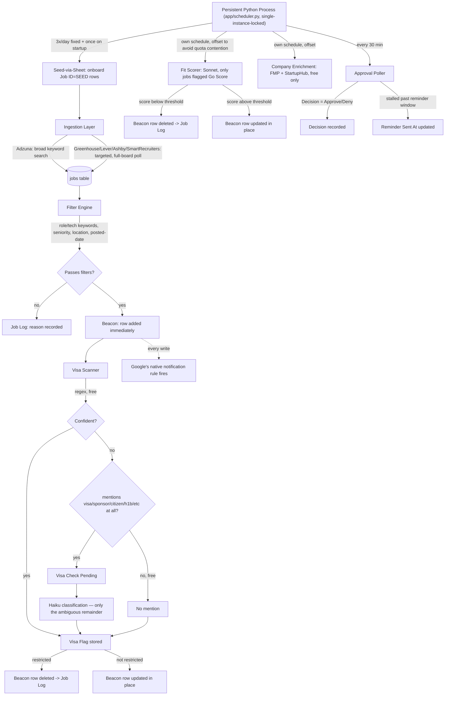

# Beacon — Architecture

A condensed, public-facing version of the full internal design doc — see `job-search-app-technical-spec.md` and `job-search-app-prompt.md` in the repo root for the complete build history, every bug found and fixed, and every design decision's rationale.

## System Diagram

## Component Responsibilities

| Component | Responsibility |
|---|---|
| **Scheduler** (`app/scheduler.py`) | One long-lived `BlockingScheduler` process, four independent jobs (main pipeline, fit-scoring, enrichment, approval poll) plus a startup catch-up run. An OS-level exclusive file lock prevents two instances running concurrently against the same DB/Sheet. |
| **Seed-via-Sheet** | Lets you onboard a new tracked company by typing its name into a Beacon row with `Job ID = SEED` — no manual API research needed. Guesses plausible board slugs and verifies each against Greenhouse, Lever, Ashby, and SmartRecruiters in turn, accepting a match only if the guessed slug actually appears in the returned postings' own URLs. |
| **Ingestion Layer** | Broad discovery via Adzuna (keyword + location + date, one query per active keyword) and targeted full-board polling of four ATS platforms for companies you specifically track. Dedup, retry/backoff, and closed-posting detection are shared across both. |
| **Filter Engine** | Live, DB-backed criteria — two independently-editable keyword categories (role titles, tech/domain terms), seniority, location, posted-date window, company priority tier, title excludes. A passing job gets a Sheet row immediately; nothing waits on the more expensive steps below. |
| **Visa Scanner** | Three tiers, cheapest first: regex on explicit phrasing → a free keyword pre-check (does the text mention sponsorship at all?) → Claude Haiku for the genuinely ambiguous remainder only. See the root README's Cost Model for real numbers. |
| **Fit Scorer** | Scores a job against your resume via Claude Sonnet — only for postings you've explicitly flagged, never run automatically against the whole backlog. |
| **Company Enrichment** | Employee count, HQ, funding stage, revenue — from two free-tier APIs only (Financial Modeling Prep for public companies, StartupHub.ai for startups). No LLM fallback exists; an unavailable field simply stays blank. |
| **Location Resolver** | Resolves messy free-text location strings to a US state using bundled, public-domain Census county/place data — no geocoding API, no per-lookup cost. |
| **Sheets Layer** (`app/sheets.py`, `app/job_log.py`) | All reads/writes to the two Google Sheets, wrapped in retry-and-backoff for rate limits. Also doubles as the entire notification system — Google's own native "notify on change" rule fires on every automated write, since the app writes as a distinct service-account identity. |
| **Approval Poller** | Reads the Decision column on a schedule; records Approve/Deny, sends a one-time stalled-decision reminder, logs consecutive Sheets-API failures. |

## Data Flow (one pipeline cycle)

1. **Seed-via-Sheet** onboards any pending `SEED` row
2. **Ingestion** pulls new postings from Adzuna + every tracked company's ATS board
3. **Filter Engine** evaluates against live criteria; a pass gets a Sheet row immediately, a fail gets a reason logged to the Job Log
4. **Visa Scanner** classifies every Beacon row's sponsorship signal, evicting anything confirmed restricted
5. *(separately scheduled)* **Fit Scorer** scores only postings flagged for scoring
6. *(separately scheduled)* **Company Enrichment** fills in firmographic data for companies currently on Beacon
7. *(separately scheduled, every 30 min)* **Approval Poller** reads your decisions and reminds you about stalled ones

## Why two separate Google Sheets

Beacon (active matches) and the Job Log (everything excluded, with a reason) are deliberately two separate spreadsheets, not two tabs in one. The notification mechanism is Google's own "email on any change" rule — if excluded jobs shared a spreadsheet with active matches, every filtered-out posting would also trigger an email. Splitting them lets Beacon stay notification-on (you want to know about real matches) while the Job Log stays notification-off (a queryable record you check on demand, not a stream of "we found nothing" emails).

## Database

SQLite in WAL mode. Core tables: `companies` (tracking + free-tier enrichment data), `jobs` (every posting ever ingested, its lifecycle status, visa/salary/location signals), `fit_scores`, `filter_settings`/`filter_keywords` (your live-editable criteria), `workflow_runs`/`step_logs` (full observability — every pipeline step, every token spent, every error). See `job-search-app-prompt.md` in the repo root for the full DDL.
