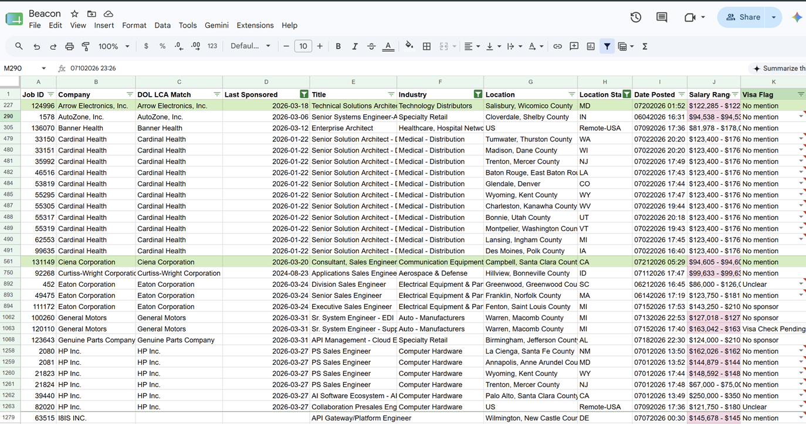
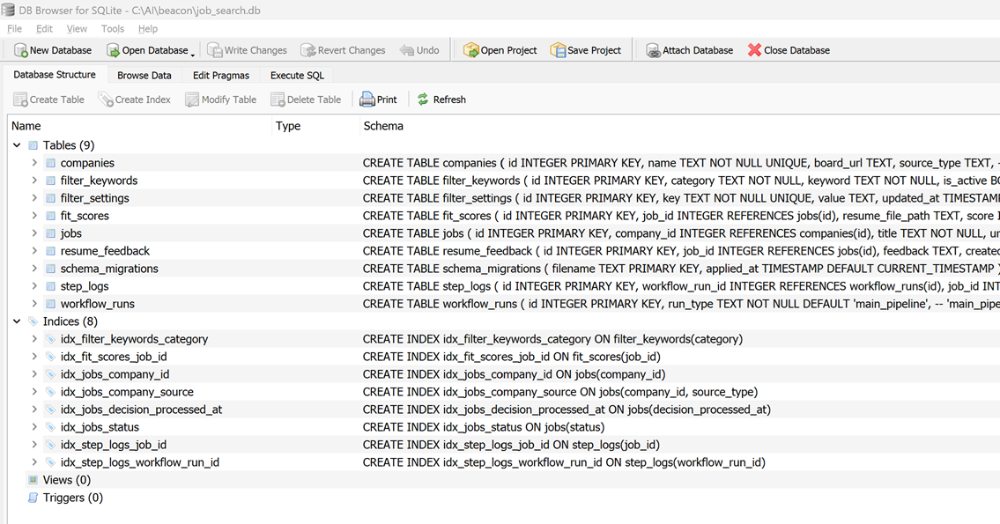
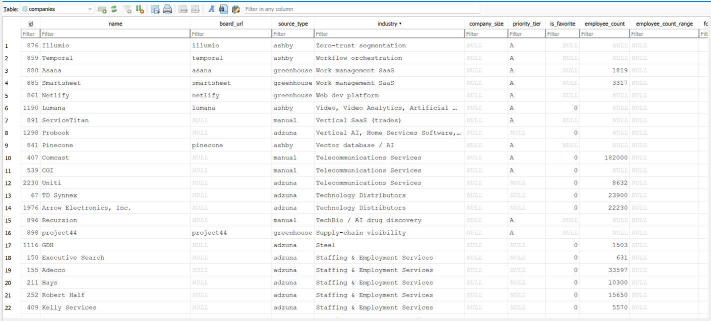
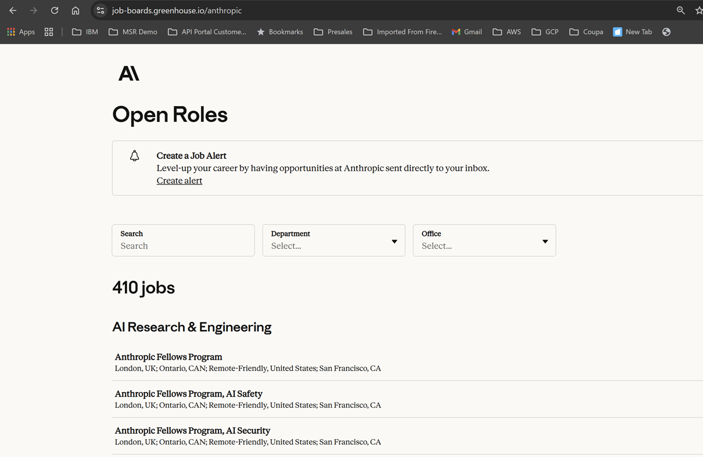

# Screenshots

The main [`README.md`](../../README.md) shows only the Beacon Tracking Sheet up top. The rest live here.

## Beacon Tracking Sheet

Company/Title/Industry/Location/Visa Flag/Salary Range/Decision columns. Decision/My Decision columns visible are unset defaults (`Pending`/`New`), not personal choices, so no redaction was needed.

## SQLite Schema

DB Browser for SQLite's "Database Structure" tab: all 9 tables and 8 indices.

## Sample Company Data

DB Browser's "Browse Data" tab on the `companies` table: real research data (industry, board URL, employee count), no personal fields.

## Source: a real public Greenhouse job board

Anthropic's real, fully public Greenhouse job board. No redaction needed, it's already public.

---

| File | Status | What it shows |
|---|---|---|
| `beacon_sheet.png` | ✅ Added | See above |
| `database_schema.png` | ✅ Added | See above |
| `database_data.png` | ✅ Added | See above |
| `source_greenhouse.png` | ✅ Added | See above |
| `job_log_sheet.png` | Not added yet | The Job Log sheet with a few excluded jobs and their rejection reasons. Same redaction rule as `beacon_sheet.png`: blur/crop the Decision/My Decision columns only if a row shows a real choice you made, not a default value. |

The root `README.md` only shows `beacon_sheet.png`. If you add `job_log_sheet.png` later, add it as its own section above too.
